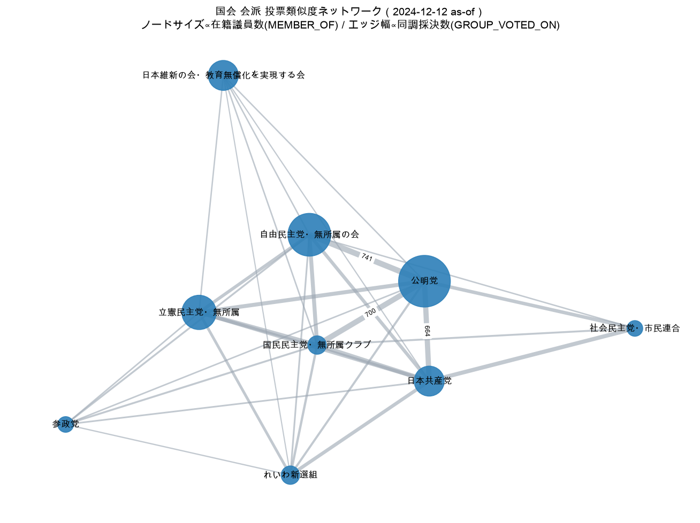
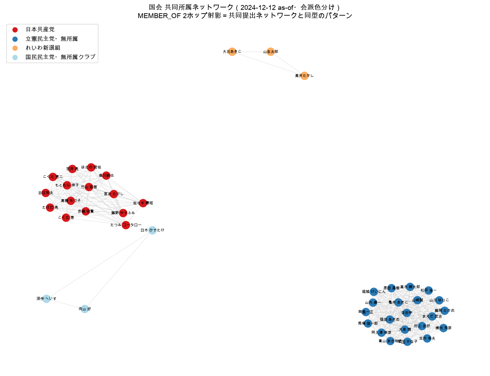

# グラフ可視化手順（BigQuery Studio / NetworkX）

`sagebase_graph.politics` のネットワークを可視化する 2 つの経路を示す。
ネットワーク系 2 クエリ（[01 投票類似度](01-voting-similarity.md) / [02 共同提出](02-co-submission.md)）の
可視化サンプルを実機出力で添付する。

---

## A. BigQuery Studio でのグラフ可視化（GQL 結果の Graph 表示）

BigQuery Studio は GQL クエリがグラフ要素（ノード・エッジ・パス）を返すとき、結果を**ネットワーク図**で
描画できる（[graph-overview](https://docs.cloud.google.com/bigquery/docs/graph-overview):
"Graph query results are displayed in a visually appealing graph format"）。

### 操作手順

1. [BigQuery コンソール](https://console.cloud.google.com/bigquery)（`asia-northeast1`）を開く。
2. クエリエディタに、**パス／要素を返す GQL**（集約ではなくノード・エッジ・パスを `RETURN` するもの）を貼る。
   集約（`COUNT(*)` 等のスカラ）はテーブル表示になるため、可視化には下記のように要素を返す。

   ```sql
   GRAPH `sagebase-gcp.sagebase_graph.politics`
   MATCH p = (a:ParliamentaryGroup)-[:BELONGS_TO_GB]->(gb:GoverningBody {name: "国会"})
   RETURN p
   LIMIT 50
   ```

3. 実行後、結果ペインの **「グラフ」/「Graph」タブ**を選ぶ（ノード・エッジを含む結果のときのみ表示される）。
4. ノードをドラッグしてレイアウト調整、ノード／エッジをクリックして属性（`name` 等の PROPERTIES）を確認。

### 制約事項

- **リージョン**: 要素テーブルのある `asia-northeast1` で実行すること。
- **Preview 仕様変更リスク**: BigQuery Graph は Preview。タブ名・描画仕様・GQL 構文は GA までに変わりうる。
- **ノード数の体感上限**: 数百ノードを超えるとレイアウトが重く判読困難になる。`LIMIT` や
  `WHERE`（自治体・会派・期間）で**100 ノード以下に圧縮**してから描画するのが実用的。
- **目視状況**: 本ページの実機サンプルは B の NetworkX で取得しています。Studio コンソール上での
  描画は BigQuery Console の「グラフ」タブに準じます。

---

## B. NetworkX による可視化（実機サンプル）

Studio が触れない環境（CLI／ヘッドレス）でも、ノード/エッジテーブルは汎用形式なので
**NetworkX + matplotlib** にそのまま流し込める。`bq query --format=csv` で抽出 → Python で描画した。
いずれも会議体・自治体・期間でスコープして**100 ノード以下**に圧縮している。

<a id="viz1"></a>

### Viz 1: 投票類似度ネットワーク（国会会派・2024-12-12 as-of）

[01 投票類似度](01-voting-similarity.md) の会派同型クエリ（`GROUP_VOTED_ON`）を、
[05 as-of](05-as-of-snapshot.md) の会派構成（`MEMBER_OF`）と重ねた図。
**ノードサイズ ∝ 在籍議員数（MEMBER_OF）/ エッジ幅 ∝ 同調採決数（GROUP_VOTED_ON）**。
PM 指定の「MEMBER_OF + GROUP_VOTED_ON の合成ネットワーク」を 1 枚に表現している（9 ノード・31 エッジ）。



> 与党ブロック（自民・公明）が太いエッジで強く結ばれる一方、野党会派も多数の形式議案で同調するため
> 相互に結線される。`judgment` 別・カテゴリ別の正規化で対立軸を抽出するのが次段。

<a id="viz2"></a>

### Viz 2: 共同所属ネットワーク（国会・会派色分け）

[02 共同提出](02-co-submission.md) の同型クエリ（`MEMBER_OF` の politician-politician 射影）を、
4 会派（共産・立憲・れいわ・国民）にスコープして描画（42 ノード・321 エッジ）。
**ノード色 = 会派**。共同提出ネットワークと同型の射影パターンが、会派ごとの視覚的クラスタとして現れる。



> 同一会派の議員が密なクリークを形成します。名寄せの本番反映後は同じ描画コードの入力を
> `edges_submitted` に差し替えるだけで、真の共同提出ネットワークになります。

### 再現手順

```bash
# 1) ネットワークデータを CSV で抽出（例: Viz1 のエッジ）
bq query --use_legacy_sql=false --project_id=sagebase-gcp --location=asia-northeast1 \
  --format=csv 'WITH kokkai_groups AS ( ... ) SELECT ga.name AS a, gb_.name AS b, COUNT(*) AS w ...' \
  > viz1_edges.csv

# 2) NetworkX + matplotlib で描画（CJK フォントを明示指定）
#    matplotlib に /Library/Fonts/Arial Unicode.ttf 等の CJK フォントを addfont する。
python render.py   # spring_layout でレイアウト → savefig で PNG
```

抽出したノード/エッジ CSV は NetworkX 以外にも Gephi / Cosmograph 等へそのまま投入できます。

### 制約事項

- **ノード数**: 可読性のため会議体・会派・期間で 100 ノード以下に圧縮すること。
- **CJK フォント**: matplotlib 既定フォントは日本語が豆腐（□）になる。CJK フォントの明示指定が必須。
- **レイアウトの非決定性**: `spring_layout` は乱数初期化のため、`seed` を固定して再現性を担保する。

---

## カバレッジ注記

本ページの可視化は、実データのある `GROUP_VOTED_ON` / `MEMBER_OF` で構成しています。
`SPOKE_IN` の名寄せカバレッジ、`edges_submitted` などの反映状況の最新版は
[README](README.md) の「データカバレッジ注記」に一元化しています。
